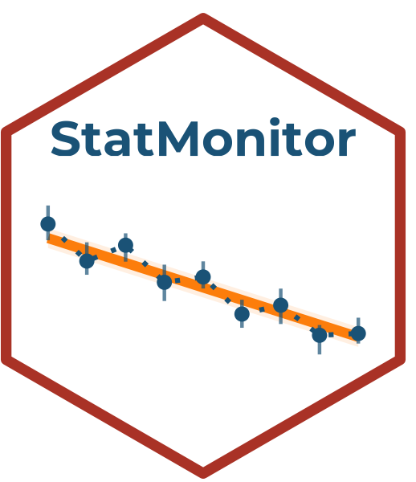

# StatMonitor 

**StatMonitor** es una plataforma interactiva para monitoreo de biodiversidad, parte del ecosistema [StatSuite](https://github.com/ManuelSpinola). Diseñada para enseñanza e investigación en ecología y ciencias de la biodiversidad.

## Módulos disponibles

| Módulo | Descripción |
|--------|-------------|
| Conceptos | Fundamentos del monitoreo de biodiversidad |
| Mis datos | Cargar y gestionar datos de monitoreo |
| Tendencias | Análisis de tendencias poblacionales |
| Técnicas de análisis | Métodos de análisis para monitoreo |
| Acerca de | Información del proyecto |

## Instalación

```r
install.packages("remotes")
remotes::install_github("ManuelSpinola/StatMonitor")
```

## Uso

```r
library(StatMonitor)
StatMonitor::run_app()
```

## Autor

**Manuel Spínola**  
ICOMVIS · Universidad Nacional · Costa Rica

## Licencia

MIT
